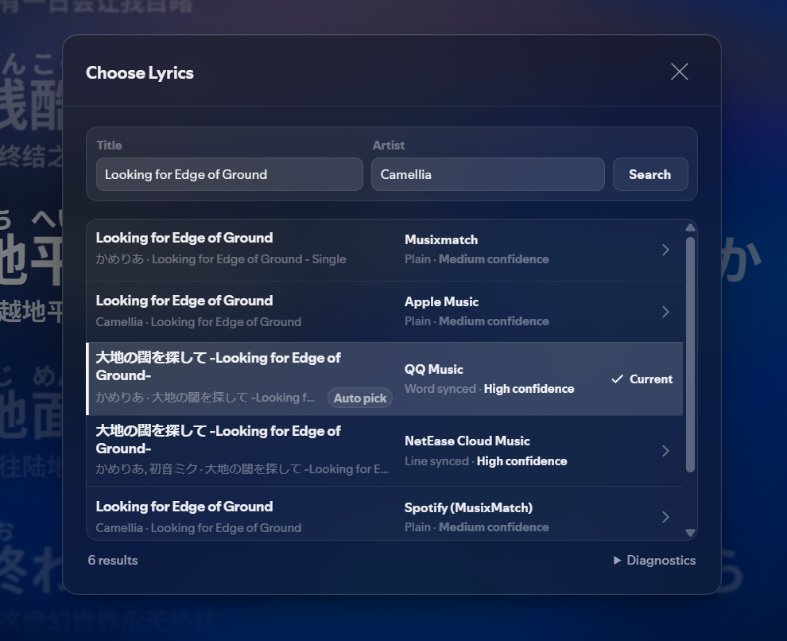

# Spicy Lyrics (tofu's fork)

Personal, experimental fork of [amarinne/spicy-lyrics](https://github.com/amarinne/spicy-lyrics), itself a fork of [Spikerko/spicy-lyrics](https://github.com/Spikerko/spicy-lyrics). I work on this for fun when I have time, so updates and support aren't guaranteed.

<p align="center">
  
  
</p>

## Fork stuff

### Lyrics and sources

- Extra sources through an optional self-hosted Worker: AMLL TTML DB, QQ Music, KuGou, NetEase Cloud Music, and Soda Music. [Set up the Worker](worker/README.md).
- A source manager for enabling, disabling, and ordering providers.
- Embedded provider headers, credits, and rights notices can be hidden with **Hide Embedded Provider Info**.
- TTML is parsed on your device, so local lyrics load without a network round trip.
- **Choose Lyrics** ranks every candidate so you can pick a different one, and remembers the choice for that track. When Spotify metadata is romanized, localized, or wrong, search again with the original title and artist.

<p align="center">
  
</p>

### Readings and display

- Japanese reading hints from the lyrics, such as `天(そら)`, become furigana and romaji, override inferred readings, and appear in amber.
- Improved local Pinyin for Mandarin word grouping and context-dependent pronunciations, plus an option to show readings above Han characters.
- Various quality-of-life improvements and fixes throughout.


## Install from source

There are no releases right now, so you'll need to install it from source. You need [Spicetify](https://spicetify.app/) and Node.js 20.19+ (20.x) or 22.12+.

```powershell
git clone https://github.com/eepytofu/spicy-lyrics.git
cd spicy-lyrics
npm ci
npm run build
```

Copy `dist/spicy-lyrics.js` to the Spicetify `Extensions` directory, then enable it:

```powershell
spicetify config extensions spicy-lyrics.js
spicetify apply
```

After pulling an update, run `npm ci` again, rebuild, and replace the extension file.

## External sources

I don't provide a shared Worker URL. Follow [Worker setup](worker/README.md) if you want to deploy your own.

Open **Settings → Sources → Lyrics Sources → Manage Sources**. Paste only the Worker origin into **External Sources Worker**, then enable and arrange the providers. Do not append `/v1/lyrics`.

<details>
<summary><strong>Custom lyric server contract</strong></summary>

Custom-server support is still experimental and hasn't been fully tested end to end yet. Custom servers use the same source panel, and Spicy Lyrics sends a `GET` request to:

```text
<configured-base-url>/<spotifyTrackId>?title=...&artist=...&artist_name=...&album=...&duration=...
```

The response can be native Spicy Lyrics JSON, TTML, LRC, or plain text. Native JSON can preserve syllable timing, translations, duet roles, and background vocals. HTTPS is required except for localhost development.

</details>

<details>
<summary><strong>Development checks</strong></summary>

Extension:

```powershell
npm test
npm run lint
npm run build
```

Worker:

```powershell
cd worker
npm test
npm run typecheck
npx wrangler deploy --dry-run
```

If source changes aren't showing up, clear the current song caches under **Advanced**. Spotify updates or `spicetify apply` can reset extension settings, so check those settings before debugging.

</details>

## Service, security, and license notes

Some lyric sources use unofficial interfaces and may stop working. Lyrics and metadata may have their own terms or usage rights, so keep that in mind if you deploy, log, use, or redistribute them.

The optional Worker has open CORS and no built-in authentication or rate limiting. Review the code and add whatever Cloudflare protections you need before putting it on a public or high-traffic deployment. See [SECURITY.md](SECURITY.md) and [worker/NOTICE.md](worker/NOTICE.md) for scope and attribution.

<details>
<summary><strong>Credits and references</strong></summary>

- [Spikerko/spicy-lyrics](https://github.com/Spikerko/spicy-lyrics) is the original project and renderer; [amarinne/spicy-lyrics](https://github.com/amarinne/spicy-lyrics) is the direct base for this fork and its lyrics-processing pipeline.
- [iPixelGalaxy/spicy-lyrics](https://github.com/iPixelGalaxy/spicy-lyrics): source-manager, custom-server, and custom-font references.
- [Robotxm/ESLyric-LyricsSource](https://github.com/Robotxm/ESLyric-LyricsSource) and [WXRIW/Lyricify-Lyrics-Helper](https://github.com/WXRIW/Lyricify-Lyrics-Helper): external-provider compatibility, search, matching, retrieval, and timed-lyrics parsing references.
- [MuttonString/Furigana](https://github.com/MuttonString/Furigana) and [Hxjjxg/Furigana-api-fixed](https://github.com/Hxjjxg/Furigana-api-fixed): references for repairing Japanese text from Chinese lyric services.
- [Kuroshiro](https://github.com/hexenq/kuroshiro), [Kuromoji.js](https://github.com/takuyaa/kuromoji.js), [Pinyin Pro](https://github.com/zh-lx/pinyin-pro), and [OpenCC.js](https://github.com/nk2028/opencc-js) provide local reading analysis and CJK conversion. [Jitendex](https://jitendex.org/), [JmdictFurigana](https://github.com/Doublevil/JmdictFurigana), and EDRDG's [JMdict/KANJIDIC](https://www.edrdg.org/edrdg/licence.html) provide source and validation data for generated Japanese readings.
- [amll-dev/amll-ttml-db](https://github.com/amll-dev/amll-ttml-db) provides the community TTML database; [yeahnangua/beautiful-lyrics-reborn](https://github.com/yeahnangua/beautiful-lyrics-reborn) is a Worker architecture reference.
- [chenmozhijin/LDDC](https://github.com/chenmozhijin/LDDC): referenced by compatibility code kept from upstream.

Keep upstream notices when redistributing modified versions.

</details>

## License

[GNU Affero General Public License v3.0](LICENSE). Derived files keep their existing notices where noted.
